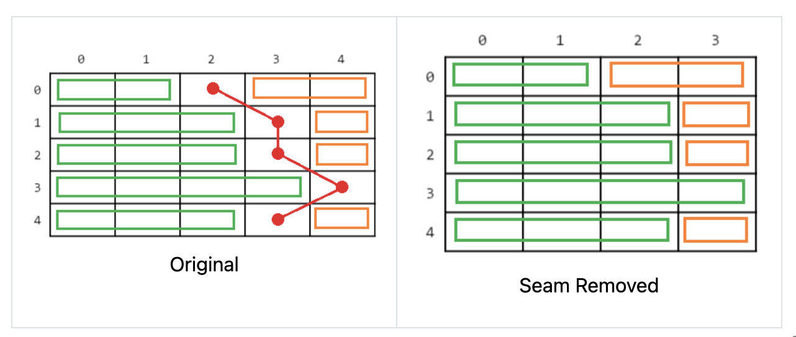
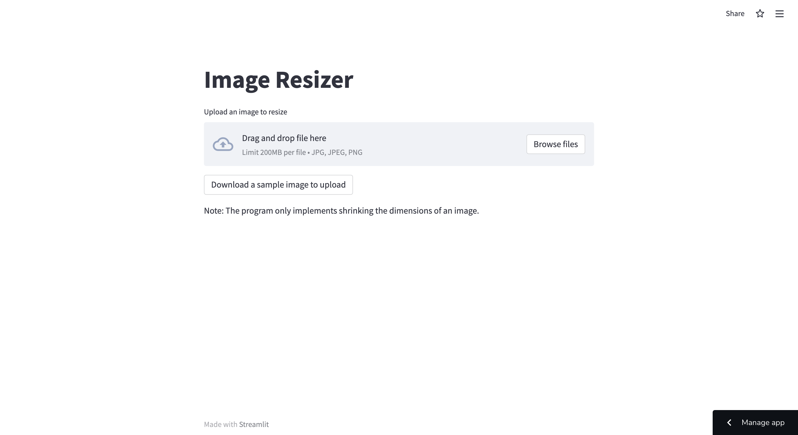
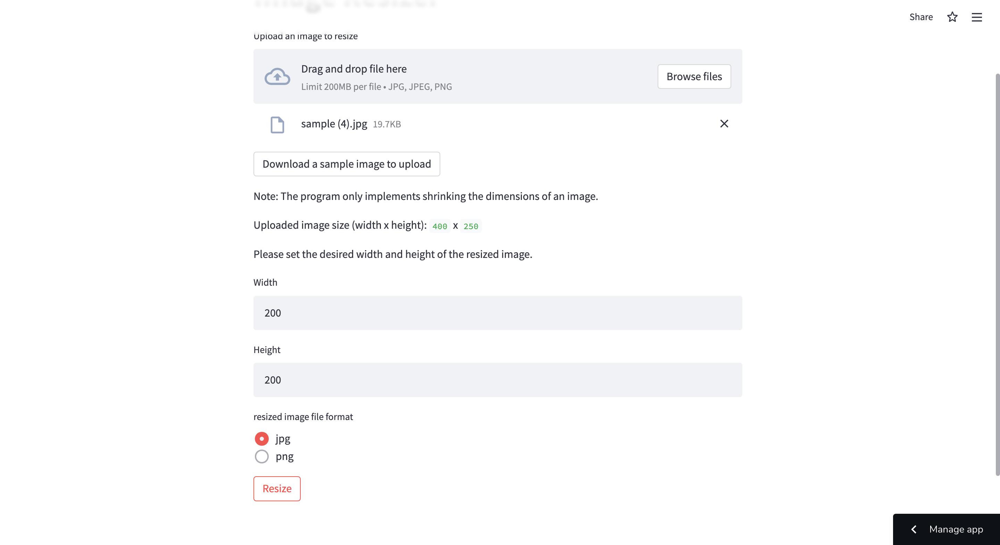
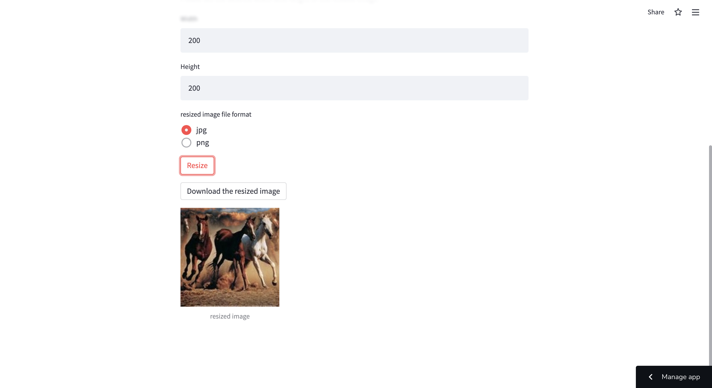

# Seam Carving (Python: Streamlit)

Link to the app: https://share.streamlit.io/rtorii/seam-carving/main/main.py

**Description:**

This is a web app which uses the seam carving algorithm to resize an uploaded image using seam carving. The app is deployed using Streamlit Share. Seam Carving works by finding and removing seams in the image that pass through the least important pixels. Here is an example.

|  |  |
| ------ | ------ |
| Original: 400x250 | Resized: 200x200 | 

_**Note:** The program only implements shrinking the dimensions of an image._

**Reference:** Seam carving library: https://github.com/li-plus/seam-carving

**Seam Carving Algorithm:**

The seam carving algorithm is to repeatedly execute the procedure for removing seams that pass through the least important pixels in an image until the image has reached the appropriate width.
1. Compute the energy matrix
2. Compute the cost matrix
3. Find the minimal cost seam
4. Remove the minimal cost seam

**How to use the app:**

1. Upload an image to resize.
2. Type in the desired width and height of the resized image. They should be no greater than the original image.
3. Choose the file format (jpg or png) of the resized image.
4. Press the "Resize" button for the program to start resizing the image.
5. The download button will appear after the process is complete. Press the button to download the resized image.

| Home page |  
| ------ | 
|  |  

| After uploading an image |
| ------ |
| |

| Downloading the resized image | 
|  ------ |
|  |

Created By Ryota Torii <rtorii@protonmail.com> on 04/28/22.

