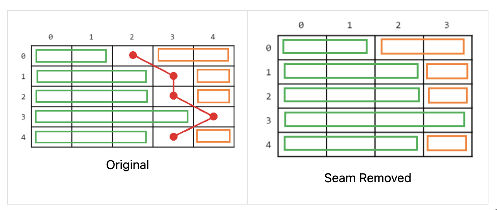
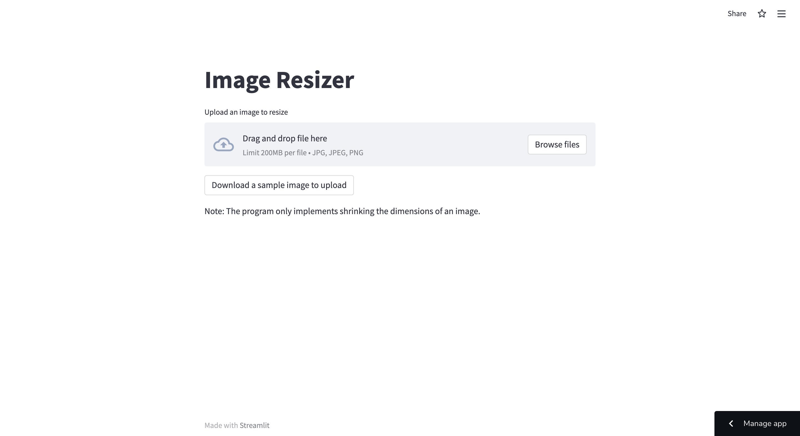
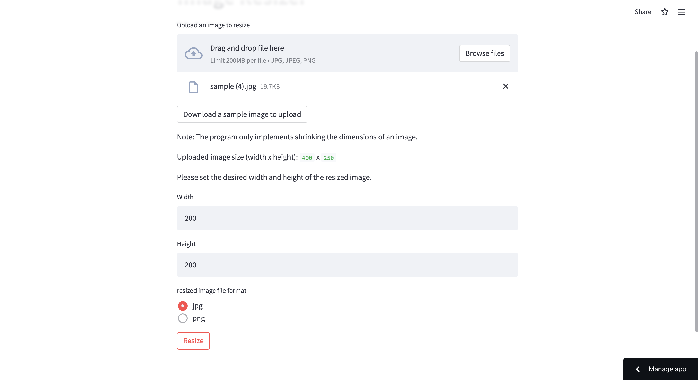

# シームカービング (Python: Streamlit)

アプリのリンク: https://share.streamlit.io/rtorii/seam-carving/main/main.py

**説明:**

このWebアプリは、アップロードされた画像を、シームカービングを使用して指定されたサイズに縮小します。アプリはStreamlit Shareでデプロイしました。シームカービングは、画像の中で最も重要でないピクセルを通過する継ぎ目を見つけ、それを取り除きます。以下は、プログラムが縮小した画像の例です。

|  |  |
| ------ | ------ |
| 元の画像: 400x250 | 縮小後: 200x200 | 

**参照:** 使用したシームカービングのライブラリ: https://github.com/li-plus/seam-carving

**シームカービングの仕組み:**

シームカービングでは、画像の最も重要でないピクセルを通るシームを削除する手順を、画像が適切な幅になるまで繰り返し実行します。
1. エネルギー行列を計算する。
2. コスト行列の計算。
3. 最小コストのシームを求める。
4. 最小コストのシームを削除する。

**アプリの使い方:**

1. 縮小したい画像をアップロードします。
2. 縮小画像の幅と高さを入力します。
3. 縮小画像のファイル形式（jpg、またはpng）を選択します。
4. 「Resize」ボタンを押すと、プログラムが画像の縮小を開始します。
5. 処理が完了すると、「Download the resized image」ボタンが表示されます。ボタンを押すと、縮小画像をダウンロードします。

| ホームページ |  
| ------ | 
|  |  

| 画像をアップロードした後 |
| ------ |
| |

| 縮小された画像をダウンロード | 
| ------ |
|  ------ |
|  |

04/28/22に作成。

